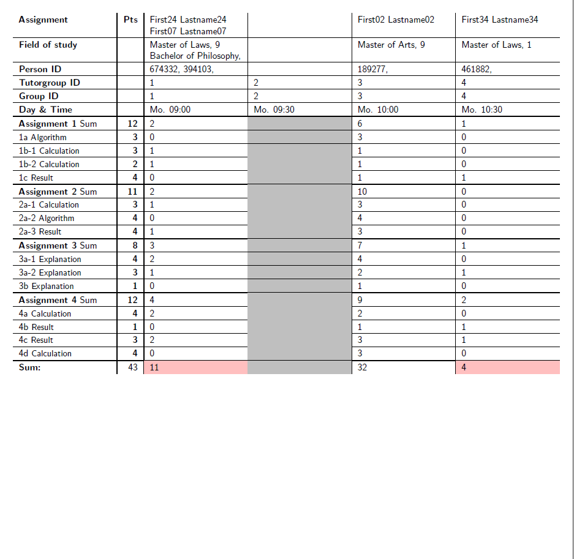

# Evaluation Sheet Template

## Description
This is a LaTeX template to generate evaluation sheets.
Given data about the participants and the assignments, this template allows to
generate evaluation sheets with one of two layouts.

  
  

## Table of Contents
1. [List of Features](#list-of-features)
1. [Installation](#installation)
2. [Usage](#usage)
3. [Contributing](#contributing)
4. [Credits](#credits)
4. [License](#license)

## List of Features

- Select from two layouts
- Process a list of participants
- Process a list of assignments
- Process points of each group

For a more detailed explanation about this project, take a look into the
[wiki](https://github.com/rwarnking/evaluation-sheet-template/wiki) of this project.
There you can also find information about the syntax of the different files.

## Installation

To use the template and generate a evaluation sheet yourself you need a LaTeX distribution
e.g. [TeX Live](https://www.tug.org/texlive/) and the required packages.

Alternativly you can use one of the install scripts
([bash](https://github.com/rwarnking/evaluation-sheet-template/blob/main/install.sh) |
[powershell](https://github.com/rwarnking/evaluation-sheet-template/blob/main/install.ps1))
to install all dependencies automatically.

### Dependencies

These packages are needed:
- [datatool](https://www.ctan.org/pkg/datatool)
- [xinttools](https://www.ctan.org/pkg/xint)
- [xintfrac](https://www.ctan.org/pkg/xint)
- [forloop](https://www.ctan.org/pkg/forloop)
- [calc](https://www.ctan.org/pkg/calc)
- [tikz](https://www.ctan.org/pkg/pgf)
- [adjustbox](https://www.ctan.org/pkg/adjustbox) for `trimclip`
  - Requires: [collectbox](https://www.ctan.org/pkg/collectbox)
- [xstring](https://ctan.org/pkg/xstring)
- [arydshln](https://ctan.org/pkg/arydshln)

Required if used in the tasks:
- [listings](https://www.ctan.org/pkg/listings)
- [enumitem](https://www.ctan.org/pkg/enumitem)

These packages are also needed but should usually be installed by default:
- [inputenc](https://ctan.org/pkg/insdljs)
- [geometry](https://www.ctan.org/pkg/geometry)
- [array](https://www.ctan.org/pkg/array)
- [tabularx](https://www.ctan.org/pkg/tabularx)

## Usage

Decide which layout you want to use (tasks as columns or as rows) and
compile the corresponding `.tex` file
(`evaluation-sheet-taskrow.tex` | `evaluation-sheet-taskcol.tex`) to a PDF.

If you want to compile multiple sheets at once you can use the compile script:
[bash](https://github.com/rwarnking/evaluation-sheet-template/blob/main/compile_all.sh) |
[powershell](https://github.com/rwarnking/evaluation-sheet-template/blob/main/compile_all.ps1)

These expect a source folder in which the sheet information is saved.
After executing the command, the script tries to automatically compile all found sheets to
the corresponding PDFs. It is also possible to specify the tutor-id for which to compile
the sheets as well as which layout to use. For more information run `.\compile_all.[sh|ps1] -h`.

## Contributing

I encourage you to contribute to this project, in form of bug reports, feature requests
or code additions. Although it is likely that your contribution will not be implemented.

Please check out the [contribution](docs/CONTRIBUTING.md) guide for guidelines about how to proceed
as well as a styleguide.

## Credits
Up until now there are no further contributors other than the repository creator.

## License
This project is licensed under the [MIT License](LICENSE).
